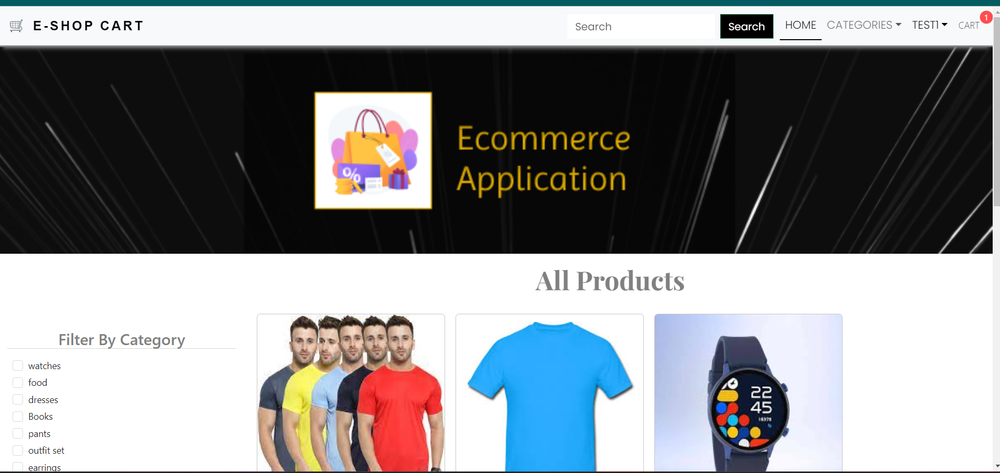
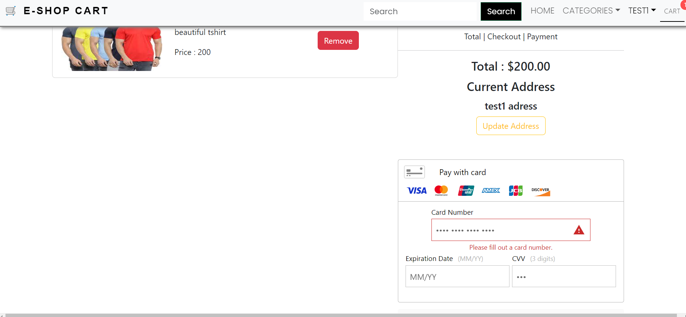
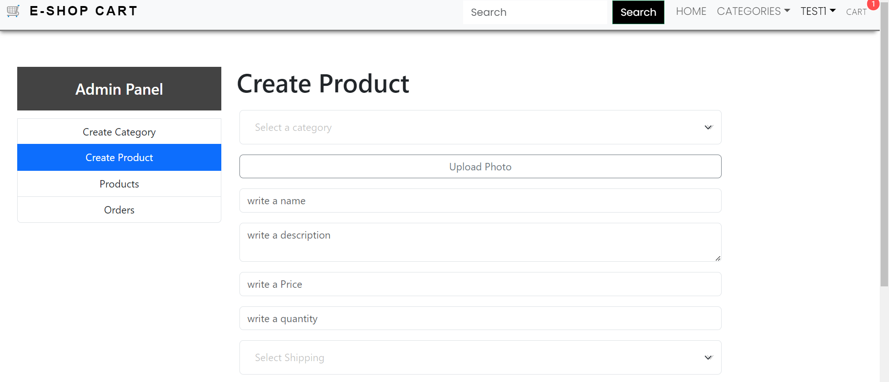

**E-shop cart** is an e commerce application where buyers and sellers can find their way in digital world

*Buyers* can use admin panel to create products and *customers* can purchase products here..


node version = 18.13.0

[Live View of Application] (https://e-shop-cart.onrender.com/)


made by Namandeep Negi.


for development and contributions follow these steps --
```
[clone repository in ypur local environment ] (git clone git@github.com:NamandeepNegi/e-commerce-application.git)

//for server or backend
`npm install`

//for client or frontend
`cd client `
`npm install`
```

# this is the front page of application after login


# this is how you can do paymnet and checkout your favourite item


# this is how admin can create products and categories and update and delte products made by them
